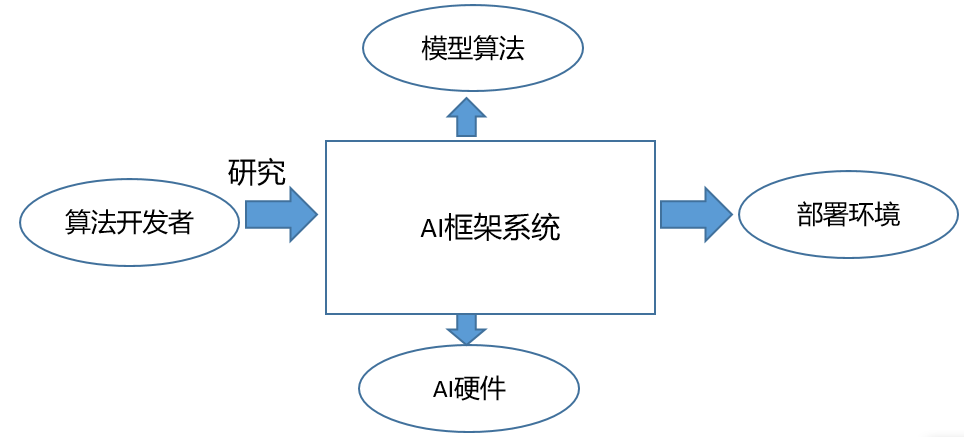
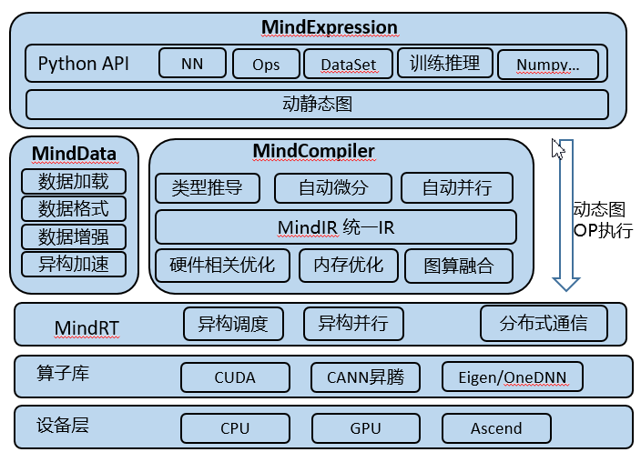

第二部分：进阶篇

​        第一部分基础篇介绍了机器学习系统的基础，首先把机器学习系统作为一个黑盒系统，介绍机器学习系统的使用场景和主要需求，机器学习系统提供给用户的编程接口。以及一个典型的机器学习系统中的计算图构建、生成和调度的过程和主要技术。第二部分进阶篇，将站在系统设计的角度，思考在设计现代机器学习系统中需要考虑的问题和解决方案，详细的技术方案介绍在后面的章节会具体展开，本节重点介绍机器学习系统的总体架构以及进阶篇各章节之间的关系。
​         机器学习系统面临的挑战可以从如下四个方面的变化趋势来看，如图所示，横向表示的是模型算法研究，生产和部署的过程，纵向表示的是AI系统支撑的模型算法应用以及支持AI系统的芯片硬件：

1. 面向算法开发者：怎样提高算法开发的效率并兼顾运行性能？怎样让算法开发者减少学习成本随心所欲的表达算法思想？等一系列问题是机器学习系统需要考虑的问题。按照构建计算图的方式，AI框架分为了静态图和动态图两种类型：静态图在执行前先进行构图和编译优化，需要使用系统提供的构图API进行构图，其表达受限于API的灵活和丰富程度，但由于静态图先编译后执行，执行期性能较高；动态图则是边执行边构图，符合算法开发人员的使用习惯，由于直接使用Python生态，可以做到会Python就会写算法；动态图逐语句执行，调试方便，算法开发效率很高，但动态图的执行效率一般情况下不如静态图。
2. 面向部署：怎样将AI模型算法部署到每个设备、每个应用、每个行业？由于各个设备的算力和资源属性差别巨大，尤其是端侧和边缘侧的某些设备硬件资源极其受限，机器学习系统本身和模型大小和能效比有严苛的要求，以智能手表为例，其要求框架严格限制在100KB以内，能效/功耗比要能支持较长的待机时间要求。而另一方面，AI模型越来越大，即使部署在端侧的模型也动辄几十MB，占用大量的内存、计算和通信资源。因此机器学习系统需要解决跨系统、跨设备、极致轻量化部署的问题。
3. 面向算法和数据：从计算规模看，AI模型规模呈现指数级增长，2021年模型规模已经达到十万亿参数，预计很快会增长到百万亿参数，怎么应对模型越来越大的挑战；从计算范式看，如何处理不断涌现的新的计算范式。机器学习系统过去是由机器学习、深度学习为主的，未来会不会支持其他的负载，比如：科学计算、数据分析、图形计算等，这样可以最大化的利用资源和提高开发易用性。
4. 面向硬件：如果把AI加速器按照GPU、多核/众核、DataFlow架构来进行分类的话，DataFlow的架构占比一半左右，Dataflow架构虽然在能效比上有很大的优势，但是加大了可编程性和性能优化的难度，如何充分发挥芯片的性能进行极致的性能优化？

![影响机器学习系统架构的因素](../img/ch01/framework_architecture.svg）

​      上述四个方面的不同需求，在设计AI框架系统的时候，需要基于场景充分的予以考虑，另外还需要考虑：

通用性:也可以成为泛化性，是不是所有的模型算法同一套代码，没有针对某个网络的特殊定制代码？ 是不是所有硬件同一套机制，在机器学习系统中针对特定硬件版本的定制只存在于硬件相关层？

易用性：对新用户而言，易用性关注更多的是入门的门槛，能不能一键式的安装、升级和运行常见的模型；对深度用户，如：算法研究人员而言，是不是能够轻松的表达算法、调试算法和部署算法模型是易用性的重点。另外，生态兼容性是易用性的一个重要考量，方便的使用常用的工具、第三方库兼容和对接，支持更多的硬件进行训练和部署是重要的因素。

性能：追求性价比、性能功耗比、大规模集群的性能加速比是机器学习系统性能的主要衡量指标，MLPerf、AIPerf榜单主要比拼的是典型网络在不同系统上的综合性能指标，机器学习系统中提供的系统优化机制对性能起到了重要作用。

​		在机器学习系统的架构设计中，采用三层架构来应对这些挑战和需要考虑的问题。 下图是MindSpore的总体架构图，就是以AI编译器为核心的三层架构设计。第一层MindExpression表示层，提供灵活的模型/算法表示，考到到生态兼容性，采用Python作为主要的编程语言，后续也可以提供其他编程语言的扩展如：Julia、仓颉等编程语言。支持常见的第三库如：Numpy、Scipy等，数据处理支持常用的数据处理库，如：opencv的API等；第二层MindCompiler，AI编译器负责机器学习系统的编译优化，包括自动微分、硬件无关的优化，硬件相关的优化，分布式系统相关的优化等都在AI编译器层完成，经过这一层后，用户表达的算法和模型转换成特定硬件上的高效执行的机器代码；前端负责静态分析、类型推导以及自动微分、分布式并行子图拆分等PASS优化；后端负责硬件相关的优化，如：内存优化、图算融合等。在第二层可以看到有MindData数据处理框架，主要是因为在系统中所处的层次和MindCompiler相同，关系也比较密切。数据处理框架主要是提供数据处理格式、数据处理加速和数据处理相关的保序、分布式缓存等操作。由于数据处理和AI训练是在同一套硬件集群系统中，需要根据训练和数据处理的负载消耗情况来进行资源分配，有时候也会把数据处理相关操作在AI计算中构成一张DAG图进行调度。第三层MindRT运行时，提供不同部署环境下通用的分布式异构并行调度机制、内存分配等，对于不同的硬件使用不同的backend的设计方式。详细的介绍再后面的章节中会展开讨论，在本部分重点介绍设计的思想和章节之间的关系。

​		既要对上承接模型算法的变化，满足算法开发者研究不断探索的诉求， 又要在最终的二进制输出上满足多样性硬件的诉求，满足不同部署环境的资源要求。既要满足系统的通用，也要满足易用性的灵活性要求，还要满足性能的不断优化诉求，这里引入编译器的概念再合适不过了。 编译器概念可以很好抽象上面提到的挑战和问题，编译器的架构和机器学习系统非常吻合。编译器输入的是用户编程代码，输出的是机器执行的高效代码，编译器的作用主要是转换和优化，这和机器学习系统的输入输出，机器学习的目标是完全一致的。所以在进阶篇我们将用两个章节详细介绍AI编译器，里面的很多概念是和通用编译器中的概念是相同的，比如AOT（Ahead of Time提前编译）、JIT（Just in time）、IR（中间表示）、PASS优化、AST（Abstract Struct Trees）、副作用、闭包等概念，对编译器相关概念需要了解的读者可以翻阅相关的编译原理教材了解。

​			AI编译器是一种相对较新的概念和工具，一个强大的AI编译器将让算法科学家和开发人员享受其带来的益处，包括表达的便捷和执行的高性能，是AI框架设计的核心。为了更好的理解AI编译器架构，先从如下图传统编译器LLVM架构说起，随着越来越多的编程语言和多种不同架构的算力硬件的支持， LLVM IR为不同的前端编程语言和硬件架构提供了一个桥梁，先把前端不同的编程语言映射成统一的LLVM IR，再把LLVM IR映射到不同的后端，这样可以大大简化编译器的开发，不同的前端，不同的硬件都可以尽可能的共享LLVM IR和其上的基础设施和编译优化。在这里可以把LLVM编译器分成三个部分：前端、IR和后端。前端将高级语言转换成IR，后端将IR转换成目标硬件上的机器指令，IR作为桥梁在前后端之间进行基于IR的各种优化。这样无论是新增硬件的支持，还是新的前端支持都可以尽可能的复用IR相关的部分。IR可以是单层的IR，也可以是多层的IR， LLVM IR是典型的单层的IR，前后端优化都基于相同的LLVM IR进行。

​			在AI编译器领域往往采用多层级逐步优化的方式，对应的IR也是多层级IR的。TensorFlow等AI框架就是采用多层级IR来进行设计的，MindSpore早期版本也是使用多层次IR的，下图就是MLIR官方材料中给出的TensorFlow框架当前的IR现状，中间至少有三个层次的IR，即：TensorFlow Graph  IR， XLA （Accelerated Linear Algebra）HLO、 以及特定硬件的LLVM IR 或者TPU  IR，下面就不同的层级IR和其上的编译优化做一个简要介绍。在前一章节计算图部分提到的图优化，也称为：图编译优化，主要实现整图级别的优化和操作，如： 图优化、图切分，往往是基于Graph IR这个层次进行的，比较适合静态图的高效执行模式；由于整图级别的IR缺少相应的硬件信息，难以进行硬件相关的优化，所以在中间层次就出现了相关的硬件通用编译优化，如：XLA、TensorRT、MindSpore的图算融合等都属于这一类编译器，来针对不同的硬件进行算子融合，提升网络在特定硬件上的执行性能。在本书的第五章节编译器后端中硬件通用优化中有一个章节介绍图算融合编译器的相关设计。最后一个层次的IR是特定硬件加速器专有的IR，一般由硬件厂商自带的编译器提供，如：Ascend硬件自带的TBE编译器就是基于TVM IR生成高效的执行算子的，在本书的第6章加速器章节也会有相应章节介绍算子编译器。

​			多层级IR的优势是IR表达上更加地灵活，可以在不同层级的IR上进行合适的PASS优化，更加方便，优化算法也更加地高效；但是多层级IR也有一些劣势。首先多层级IR必然需要进行IR之间的转换，IR转换要做到兼容非常困难，工程工作量很大；IR的转换除了工程的工作量比较大以外，可能会带来信息的损失， 由于上一层IR的某些信息缺失，给下一层优化带来困难，由于会造成信息丢失对优化的影响，因此对优化执行的顺序也有更强的约束。其次多层级IR有些优化既可以在上一层IR进行，也可以在下一层IR进行，让系统开发者很难选择。最后不同层级IR定义的算子粒度大小不同，可能给给精度带来一定的影响。所以在MindSpore的架构设计中采用了统一的MindIR设计，如下图所示详细给出了AI编译器内部的运行流程和分工，所以本书中编译器前端主要是指图编译和硬件无关的优化，编译器后端主要是指硬件相关优化、算子选择等。

			性能除了在AI领域有一个很重要的需求就是要尽可能和AI硬件结合起来，发挥AI硬件的算力性能。当前AI硬件除了常见的CPU、GPU外，各种DSA架构的加速器硬件如：华为推出的Ascend昇腾AI加速器是不可忽视的AI硬件的主打硬件。在第6章加速器部分，首先对加速器硬件的架构进行介绍，理解加速器的编程手段和编程接口，在机器学习系统中就可以更好的使用加速器。
			数据是机器学习的生命线，在训练计算中有30%左右的计算时间用于数据处理，如果算上一个完整的机器学习模型训练，包括从公开的数据集中预处理数据等占比时间比例更高。ML模型数据处理需要提供灵活的数据处理能力，包括接口和自定义算子的能力，也需要高性能的处理，包括数据处理加速和分布式数据处理等，在本书第7章节数据处理框架部分进行了介绍。
			训练后的模型需要部署到各种形态的终端设备中，将智慧赋能到各行各业。当前AI部署到企业的比例还不到20%,模型部署存在着两大方面的挑战：一方面资源受限设备的CPU处理能力不强，内存和硬盘空间都很小，同时对模型执行的功耗、精度和时延开销又有严苛的指标要求，在此场景下，模型部署遇到了性能、功耗和大小的挑战；另一方面超大模型部署对算力消耗较大，需要进行分布式部署。而很多大企业往往采用统一的模型部署的云服务，需要一套服务接口提供对外服务，机器学习系统需要能适配不同的模型，不同的数据处理方法，对接不同的硬件后端，提升云端部署的效率、成本和吞吐率。本书第8章节模型部署将从模型部署的一般流程出发，详细的介绍在模型部署到手机等端侧设备上需要进行的模型转换、模型优化和模型压缩的相关技术。对于分布式场景下模型部署相关的技术进行介绍。模型部署也可以转换到和模型训练相同的IR上进行算子融合、代数化简以及硬件相关的优化，共享AI编译器相关的技术设施，采用和训练相同的IR，可以保持训练和推理的精度一致性。
		 机器学习系统中单机系统包括编译优化、加速器加速、模型部署和数据处理执行流程，如下图所示。随着模型的越来越大，AI训练单机系统已经不能满足需求，大型模型的训练需要使用到AI集群来进行训练，2021年盘古大模型的发布，就提到使用了2048个训练节点的超大规模的昇腾计算集群。在超大模型训练中，如果Scale out模型训练到集群上，需要机器学习系统支持数据并行、模型并行、流水线并行、优化器并行的能力，同时允许多种策略灵活的组合使用。由于大规模集群的系统配置的复杂度很高，无论对于算法人员还是系统人员，配置这些策略的门槛都比较高，需要机器学习系统提供半自动和自动的策略支持，适配不同模型、不同规模的集群的灵活的分布式并行策略，这些技术将在第9章节分布式训练进行介绍。

